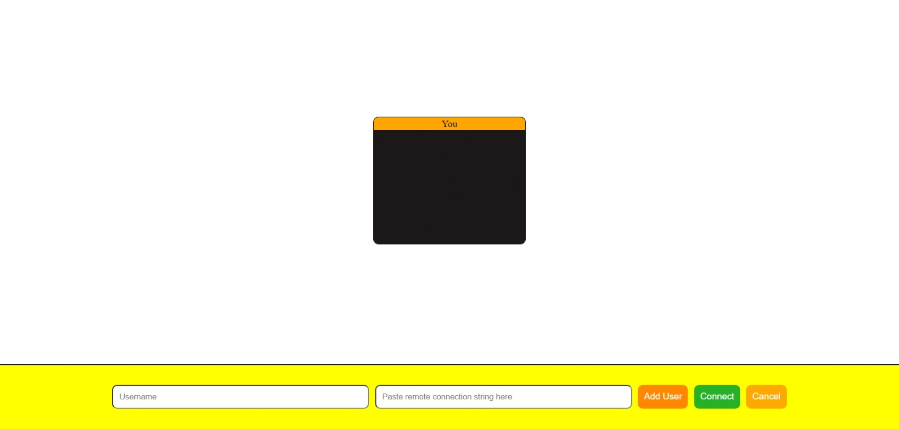

## Decentralized Meet

## Its a web app based on WebRTC, where multiple users can connect to each other with video and audio sharing

**No Server Required**, means it does not require any other 3rd party in between you can also run this HTML file into your local browser and use this app, so that comunication will always be peer to peer

### How to use
* If you already have a connection string from your friend then just past it in connection string box and click on **connect button**, then it will give you your local connection string into your clipboard (means its already copied so you can just past it anywhere you want to send) which you can share with other person so that they can add you into there local connection and boom you two will be connected
* If you are first one who wants to initiate then click on **add user button** it will give you your local connection string into your clipboard, share it with friends you want to connect they can add it in there local and will give you there local connection string which you can then set in your local and boom you guys will be connected
